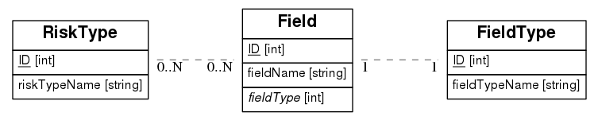

# britecore-project
Product Development project for the BriteCore interview process

## Entity relationship diagram


## Usage
edit `britecoreproject/config.py` to set the location of the database. `sample.sqlite3` contains some sample data.

```
pipenv install
pipenv shell
flask run
```

* `localhost:5000/allrisks` returns a list of all risks
* `localhost:5000/risk/<risk_id>` returns one risk by id
